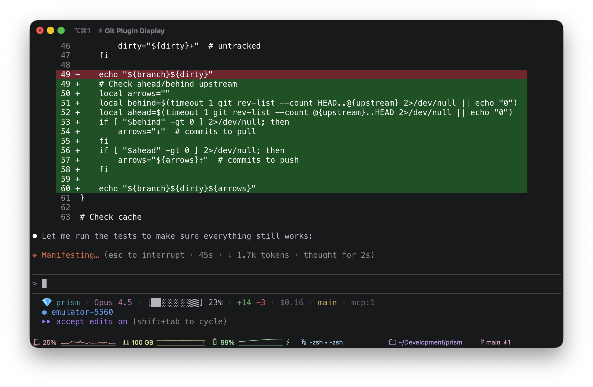

# Prism

A fast, customizable, and colorful status line for Claude Code.



## Quick Start

```bash
curl -fsSL https://raw.githubusercontent.com/himattm/prism/main/install.sh | bash
```

Then restart Claude Code or start a new session.

<details>
<summary>Manual installation</summary>

1. Download the scripts:
   ```bash
   curl -o ~/.claude/prism.sh https://raw.githubusercontent.com/himattm/prism/main/prism.sh
   curl -o ~/.claude/prism-idle-hook.sh https://raw.githubusercontent.com/himattm/prism/main/prism-idle-hook.sh
   curl -o ~/.claude/prism-busy-hook.sh https://raw.githubusercontent.com/himattm/prism/main/prism-busy-hook.sh
   chmod +x ~/.claude/prism*.sh
   ```

2. Enable in Claude Code (`~/.claude/settings.json`):
   ```json
   {
     "statusLine": {
       "type": "command",
       "command": "$HOME/.claude/prism.sh"
     },
     "hooks": {
       "UserPromptSubmit": [{"hooks": [{"type": "command", "command": "$HOME/.claude/prism-busy-hook.sh"}]}],
       "Stop": [{"hooks": [{"type": "command", "command": "$HOME/.claude/prism-idle-hook.sh"}]}]
     }
   }
   ```

3. Restart Claude Code or start a new session.

</details>

## Configuration

Prism uses a 3-tier config system:

```
.claude/prism.local.json       <- Your personal overrides (gitignored)
       | overrides
.claude/prism.json             <- Repo config (commit for your team)
       | overrides
~/.claude/prism-config.json    <- Your global defaults
```

### Quick Setup

```bash
~/.claude/prism.sh init-global  # Create global defaults
~/.claude/prism.sh init         # Create repo config
```

### Example Config

```json
{
  "icon": "🤖",
  "sections": ["dir", "model", "context", "cost", "git", "gradle", "devices"]
}
```

**Multi-line:** Use array of arrays for multiple lines:
```json
{
  "sections": [
    ["dir", "model", "context", "cost", "git"],
    ["devices"]
  ]
}
```

## Built-in Sections

| Section | Description |
|---------|-------------|
| `dir` | Project directory with smart abbreviation |
| `model` | Current model name |
| `context` | Visual context bar `[████░░▒▒]` |
| `linesChanged` | Uncommitted lines `+123 -45` |
| `cost` | Session cost `$1.23` |

## Plugins

Plugins add additional sections. Install by copying to `~/.claude/prism-plugins/`:

| Plugin | Description | Details |
|--------|-------------|---------|
| [git](plugins/git/) | Branch and status `main**+` | [README](plugins/git/README.md) |
| [devices](plugins/devices/) | Android/iOS devices | [README](plugins/devices/README.md) |
| [gradle](plugins/gradle/) | Gradle daemon status | [README](plugins/gradle/README.md) |
| [xcode](plugins/xcode/) | Xcode build status | [README](plugins/xcode/README.md) |
| [mcp](plugins/mcp/) | MCP server count | [README](plugins/mcp/README.md) |

### Writing Plugins

Plugins are executable scripts that:
- Receive JSON on **stdin** with session context, config, and colors
- Output formatted text to **stdout**
- Exit 0 with output to show, exit 0 with no output to hide

**Naming:** `prism-plugin-{name}.sh` (or `.py`)

```bash
# List plugins
~/.claude/prism.sh plugins

# Test a plugin
~/.claude/prism.sh test-plugin git
```

See [examples/prism-plugin-weather.sh](examples/prism-plugin-weather.sh) for a template.

## Development

```bash
# Run all tests
./tests/test_prism.sh
./plugins/git/test.sh
./plugins/devices/test.sh
./plugins/gradle/test.sh
./plugins/mcp/test.sh
./plugins/xcode/test.sh
```

## Dependencies

- `jq` - JSON parsing
- `adb` - Android device detection (optional)
- `xcrun simctl` - iOS simulator detection (optional, macOS only)

## License

MIT
