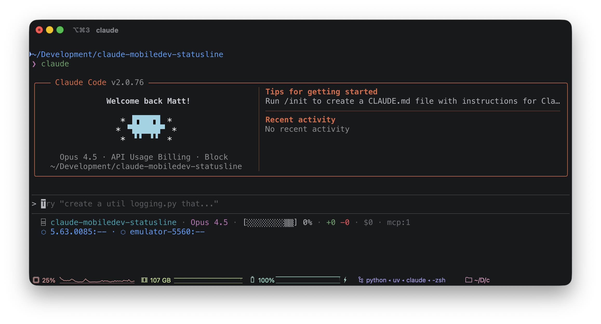
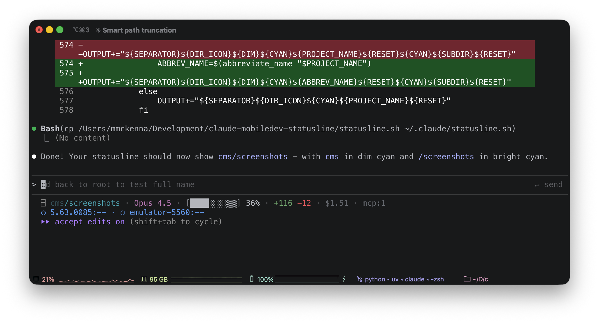

# Claude Code Status Line for Mobile Development

A custom status line for [Claude Code](https://claude.ai/claude-code) optimized for Android & iOS development.





```
⌸ my-app · Opus 4.5 · [████████▒▒] 81% · +658 -210 · $15.14 · main*+ · 𓃰3 · ⚒ · mcp:2
⬢ emulator-5560:6.89 · ⬡ emulator-5562:6.89 ·   iPhone 15:6.89
```

## Quick Start

1. **Download the script:**
   ```bash
   curl -o ~/.claude/statusline.sh https://raw.githubusercontent.com/himattm/claude-mobiledev-statusline/main/statusline.sh
   chmod +x ~/.claude/statusline.sh
   ```

2. **Enable in Claude Code** (`~/.claude/settings.json`):
   ```json
   {
     "statusLine": {
       "type": "command",
       "command": "$HOME/.claude/statusline.sh"
     }
   }
   ```

3. **Restart Claude Code** or start a new session.

## Let Claude Set It Up

Copy one of these prompts into Claude Code:

**Full installation:**
```
Install the mobile dev status line from https://github.com/himattm/claude-mobiledev-statusline

1. Download statusline.sh to ~/.claude/statusline.sh
2. Update my ~/.claude/settings.json to enable the status line
3. Ask me which icon I'd like for this repo (suggest some options) and create .claude-statusline.json
```

**Per-repo setup only:**
```
Create a .claude-statusline.json for this repo. Suggest some icon options for me to choose from, then configure my Android package name and iOS bundle ID.
```

## Customization

### Per-Repo Config

Create `.claude-statusline.json` in your repo root (committable to git):

```json
{
  "icon": "🤖",
  "android": {
    "packages": ["com.myapp.debug", "com.myapp"]
  },
  "ios": {
    "bundleIds": ["com.myapp.debug"]
  }
}
```

### Global Config

Create `~/.claude/statusline-config.json` for defaults across all repos:

```json
{
  "sections": ["dir", "model", "context", "cost", "git", "mcp"]
}
```

Per-repo config overrides global config.

### Sections

Control what appears and in what order:

```json
{
  "sections": ["dir", "model", "context", "cost", "git", "gradle", "mcp", "devices"]
}
```

Available: `dir`, `model`, `context`, `linesChanged`, `cost`, `git`, `gradle`, `xcode`, `mcp`, `devices`

Note: `devices` appears on a new line when shown.

## Features

| Feature | Description |
|---------|-------------|
| **Smart Directory** | Shows project root at start, abbreviates when in subdirs: `cms/screenshots` |
| **Context Bar** | Visual `[████░░▒▒]` showing usage, free space, and auto-compact buffer zone |
| **Code Stats** | Lines added/removed (`+658 -210`) and session cost (`$15.14`) |
| **Git** | Branch with dirty indicators (`*` staged, `**` unstaged, `+` untracked) |
| **Android** | Device list with app versions, `⬢` targeted / `⬡` non-targeted |
| **iOS** | Simulator list with app versions,  Apple logo icon |
| **Gradle** | `𓃰3` daemons running, `𓃰?` cold start expected |
| **Xcode** | `⚒2` builds running |
| **MCP** | `mcp:2` servers configured |

### Directory Display

The directory section shows where Claude was started, with smart handling when you navigate to subdirectories:

| Location | Display |
|----------|---------|
| Project root | `claude-mobiledev-statusline` (full name, cyan) |
| In subdirectory | `cms/screenshots` (abbreviated root dim, subdir bright) |
| Deep nesting | `cms/k/v/engine` (last 3 dirs, intermediate ones abbreviated) |

**Abbreviation rules:**
- Project name > 6 chars with hyphens: first letter of each segment (`claude-mobiledev-statusline` → `cms`)
- Project name > 6 chars without hyphens: first 3 characters (`screenshots` → `scr`)
- Deep paths: show last 3 directories, abbreviate all but the final one to first letter

## Reference

### Symbols

| Symbol | Meaning |
|--------|---------|
| `⬢` | Android device (targeted via ANDROID_SERIAL) |
| `⬡` | Android device (not targeted) |
| `` | iOS simulator (Apple logo) |
| `𓃰` | Gradle daemon |
| `⚒` | Xcode build |
| `█░▒` | Context: used, free, buffer |

### Troubleshooting

**Version shows "--"**
- Wait ~2 seconds for cache population
- Verify app is installed: `adb shell pm list packages | grep yourapp`

**Config changes not showing**
- Config is cached per-session. Start new session or: `rm /tmp/claude-statusline-config-*`

**Context % doesn't match /context**
- Adjust `SYSTEM_OVERHEAD_TOKENS` in script (default: 23000)

## Dependencies

- `jq` - JSON parsing
- `adb` - Android device detection (optional)
- `xcrun simctl` - iOS simulator detection (macOS only, optional)

## License

MIT
